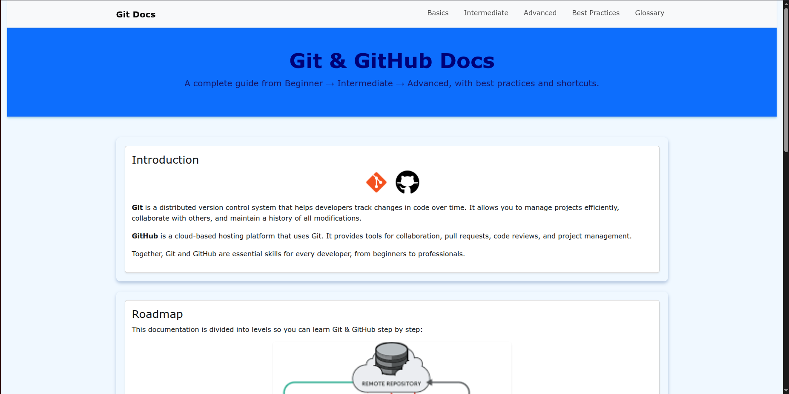
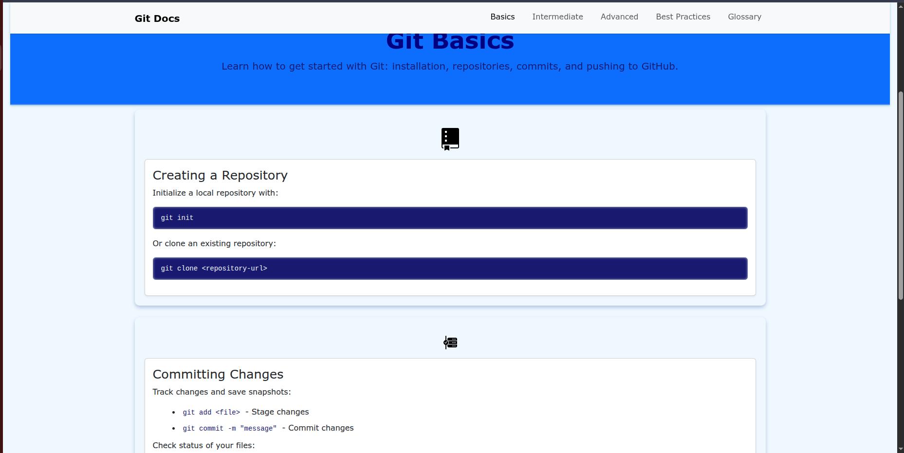
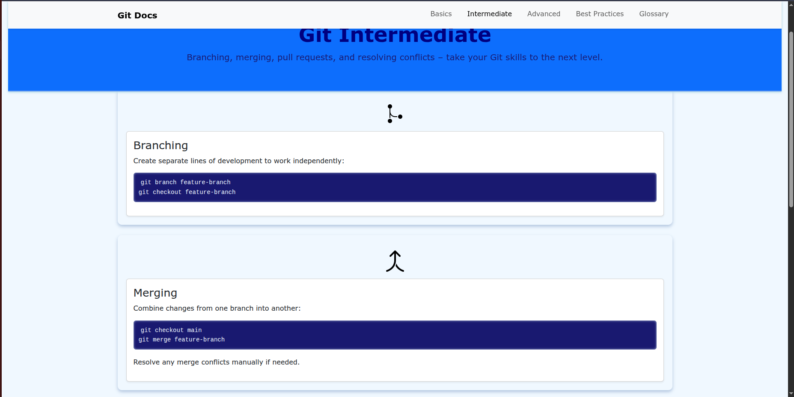
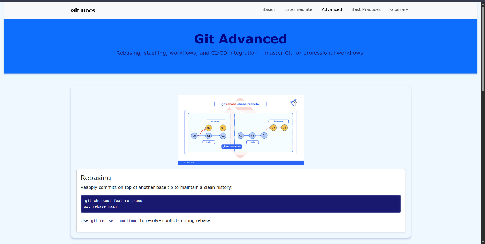
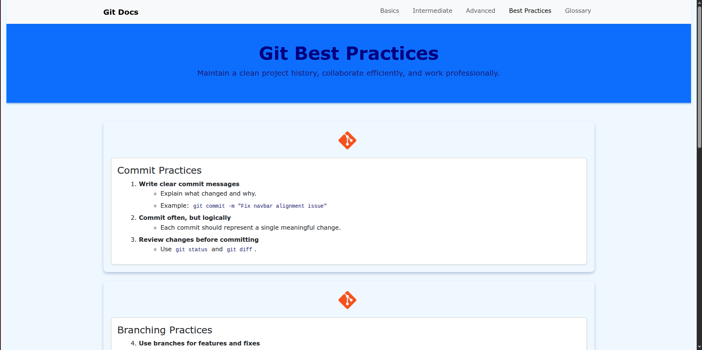
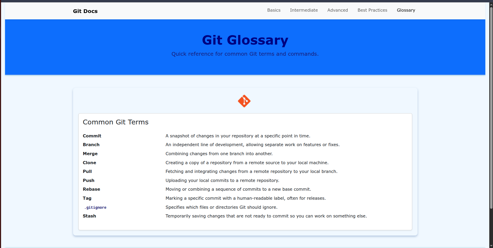

# 📚 Git Docs Website  

A beginner-friendly **documentation website** that explains **Git & GitHub concepts** with examples and visuals.  
Built using **HTML, CSS, JavaScript, jQuery, and Bootstrap**, this project serves as both a **learning resource** and a **portfolio showcase**.  

🌍 **Live Demo** → [Git Docs Website](https://nishantsg3.github.io/Git-Docs-Website/)  
🚀 **Alternative Link** → [Netlify Deployment](https://git-docs-web.netlify.app/)  

---

## ✨ Features  

✔️ Step-by-step explanations of Git basics, intermediate, and advanced concepts  
✔️ Visual diagrams and images for easier understanding  
✔️ Separate pages for:
- 🟢 Basics  
- 🟡 Intermediate  
- 🔴 Advanced  
- 📝 Best Practices  
- 📖 Glossary  

✔️ Responsive, mobile-friendly layout using **Bootstrap**  
✔️ Smooth interactions powered by **jQuery**  
✔️ Hosted on **GitHub Pages** for free access anywhere  

---

## 🛠️ Tech Stack  

- **HTML5** → Structure  
- **CSS3** → Styling  
- **JavaScript (ES6)** → Interactivity  
- **jQuery** → DOM manipulation & effects  
- **Bootstrap 5** → Responsive grid & UI components  
- **Git & GitHub Pages** → Version control + hosting  

---

## 📂 Project Structure  
```
Git-Docs-Website/
│
├── assets/
│   ├── images/          # Project images & diagrams
│   └── preview/         # Screenshots for README
│
├── index.html           # Homepage
├── basics.html          # Git basics concepts
├── intermediate.html    # Intermediate Git topics
├── advanced.html        # Advanced Git techniques
├── best-practices.html  # Git best practices
├── glossary.html        # Git terminology glossary
├── style.css            # Custom styles
├── script.js            # JavaScript functionality
└── README.md            # Project documentation
```

---

## 📸 Screenshots  

### Homepage  
  

### Git Basics  
  

### Git Intermediate  
 

### Git Advanced  
 

### Git Best Practices  
 

### Git Glossary  
 

---

## 🚀 How to Run Locally

### 1️⃣ Clone the repository
```bash
git clone https://github.com/Nishantsg3/Git-Docs-Website.git
```

### 2️⃣ Navigate to project folder
```bash
cd Git-Docs-Website
```

### 3️⃣ Open in browser
Simply open `index.html` in your browser, or use a local server:
```bash
# Using Python
python -m http.server 8000

# Using Node.js (http-server)
npx http-server
```

Then visit `http://localhost:8000`

---

## 🎯 What I Learned

- Creating multi-page documentation websites
- Responsive web design with Bootstrap
- jQuery for DOM manipulation and smooth effects
- Organizing content for educational purposes
- Deploying static sites on GitHub Pages and Netlify

---

## 🚀 Future Improvements  

- 🔍 Add search functionality across docs  
- 🌙 Dark/light theme toggle  
- 📱 Enhance responsiveness with more Bootstrap components  
- 📝 Expand advanced Git topics with interactive examples  
- 💬 Add a comments section or feedback form
- 🎥 Embed tutorial videos for complex topics

---

## 🤝 Contributing

Contributions are welcome! Feel free to:
1. Fork the repository
2. Create a feature branch (`git checkout -b feature/AmazingFeature`)
3. Commit your changes (`git commit -m 'Add some AmazingFeature'`)
4. Push to the branch (`git push origin feature/AmazingFeature`)
5. Open a Pull Request

---

## 📜 License

This project is open source and available under the [MIT License](LICENSE).

---

## 👤 Author  

**Nishant Gawande**  

- 🌐 GitHub: [@Nishantsg3](https://github.com/Nishantsg3)
- 🚀 GitHub Pages: [Git Docs Website](https://nishantsg3.github.io/Git-Docs-Website/)
- 🌍 Netlify: [Git Docs Web](https://git-docs-web.netlify.app/)

---

## 💡 Acknowledgments

- Inspired by official Git documentation
- Bootstrap for responsive design framework
- jQuery for simplified JavaScript

---

⭐ **If you found this project helpful, consider giving it a star on GitHub!**